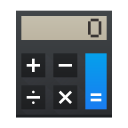

<!--
- SPDX-FileCopyrightText: None
- SPDX-License-Identifier: CC0-1.0
-->

#  KCalc

## Features

KCalc has everything you would expect from a scientific calculator, plus:

- Trigonometric functions, logic operations and statistical calculations.
- A results stack which enables convenient recall of previous calculation results.
- Precision is user-definable.
- The display allows cut and paste of numbers.
- The display colors and font are configurable, aiding usability.
- The use of key-bindings make it easy to use without a pointing device.

## Get KCalc

## Useful links
* [Code repository](https://invent.kde.org/utilities/kcalc)
* [Develop](https://develop.kde.org/docs/getting-started/building)
* [Issues](https://bugs.kde.org/buglist.cgi?product=kcalc&resolution=---)
* [Project home page](https://apps.kde.org/kcalc)
